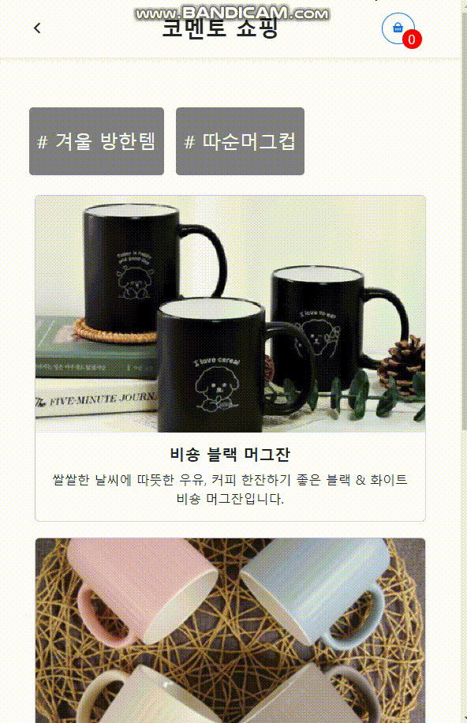
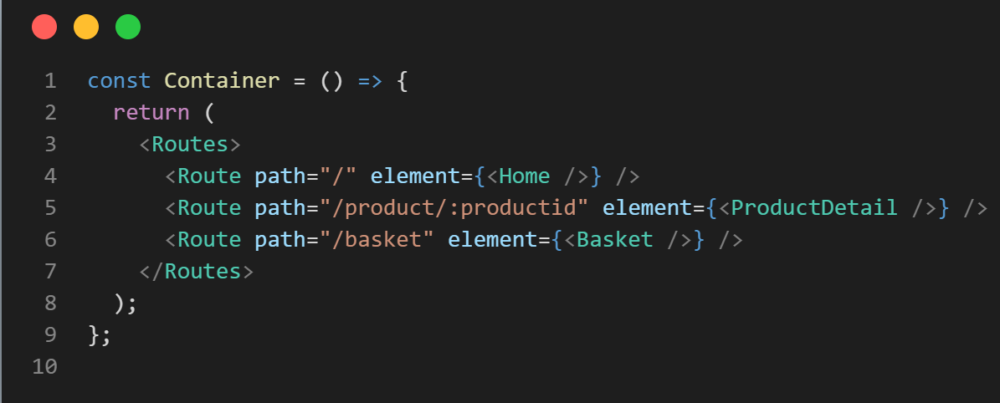
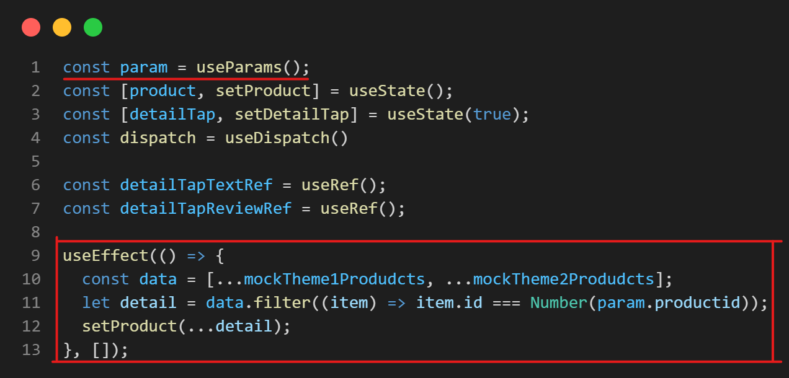
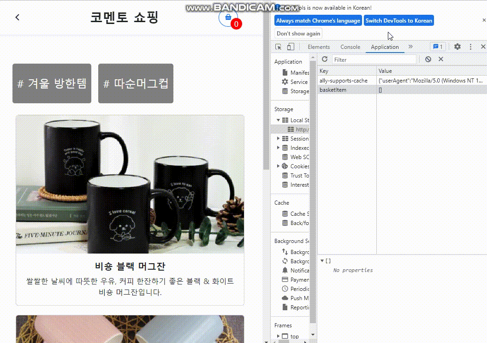
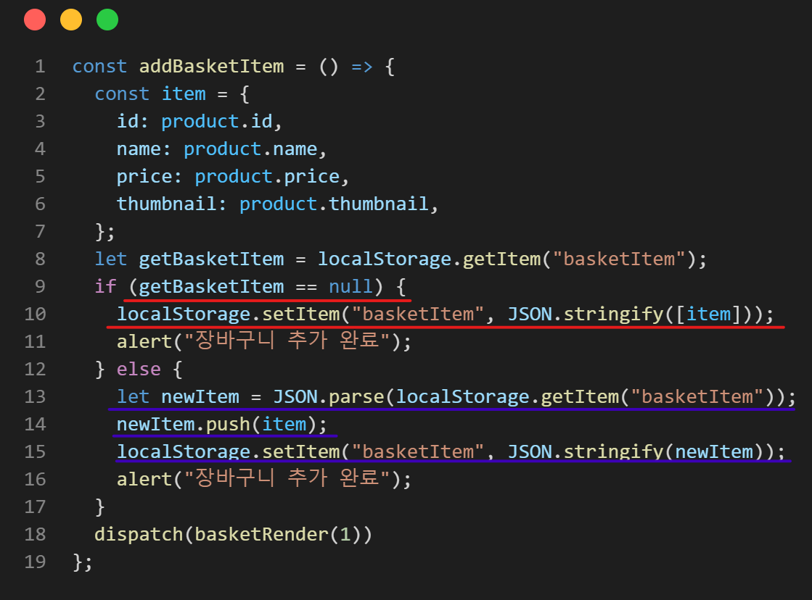
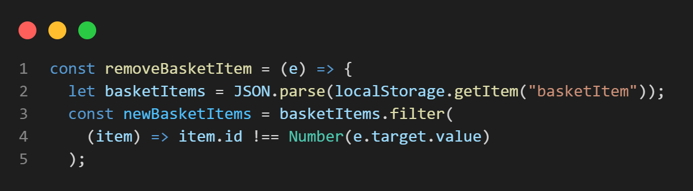
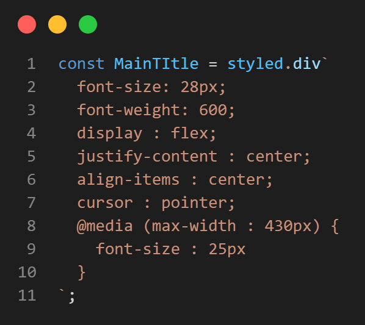
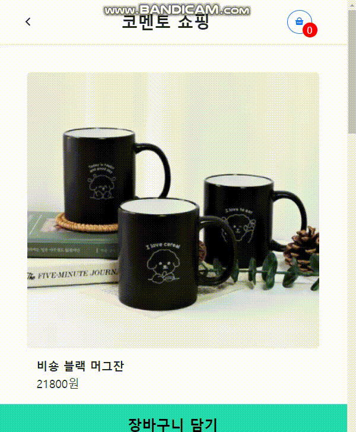
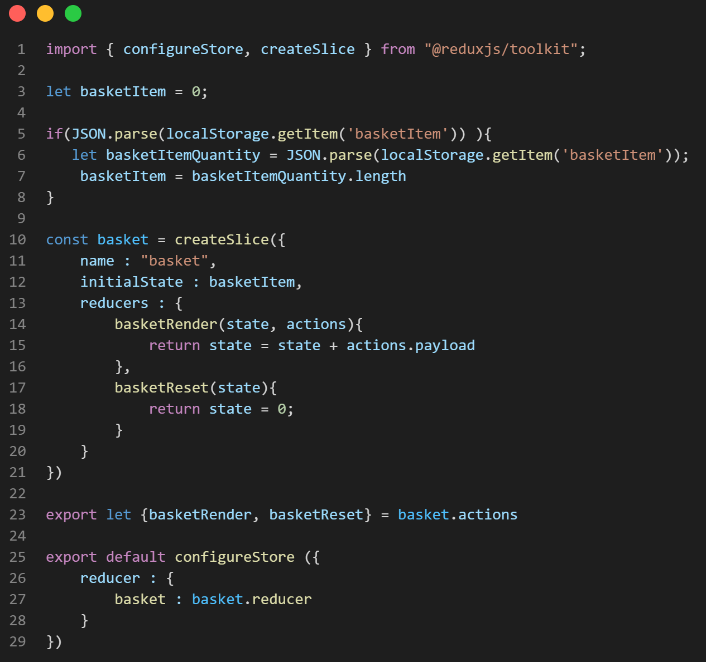
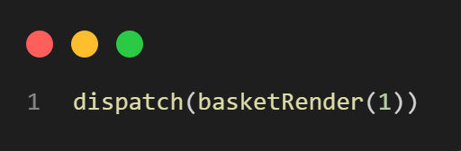

# comento-shop
---
### :white_square_button: 개발 배경
디자인 시안을 받아 React를 이용하여 구현하고 가상데이터를 바인딩 해봄으로써 프론트엔드의 업무를 간접적으로나마 느껴보고 싶어서 만들어 보았습니다.

- 가상데이터 바인딩 해보기
- **React-router-dom**을 사용하여 detail페이지 만들기
- **Local Storage**를 이용하여 장바구니 페이지 만들기
- **style-components**를 이용하여 디자인 해보기
- **redux-toolkit**을 이용하여 장바구니 물건 갯수 실시간 파악하기

배포 : https://french13.github.io/comento-shop/

---
#### :hammer: 패키지
     

---

### :white_square_button: 구현

#### :one: 가상데이터 바인딩 해보기

#### :two: React-router-dom을 사용하여 detail페이지 만들기

##### :pencil2:Container.jsx

- useParams를 이용해서 값을 가져오기 위해 Route에 productid로 id값을 추가했습니다.

##### :pencil2:ProductDetail.jsx

- useParams로 값을 가져와서 filter를 이용하여 동일한 id값을 가진 아이템을 가상데이터베이스에서 가져와 product에 넣어서 구현하였습니다.

#### :three: Local Storage를 이용하여 장바구니 페이지 만들기

##### :pencil2:ProductDetail.jsx [ localstorage에 추가하기 ]
 

- item 이라는 변수에 obj로 만든 다음 우선적 localstorage에 basketItem 이라는 key값을 찾아 없을경우 바로 추가를 하였고 basketItem이라는 key값이 있을경우 getItem을 한 후에 push로 추가한다음 넣었습니다.

- **객체이기 때문에 JSON.stringify로 변환하여 넣고 다시 가져올때는 JSON.parse를 이용하였습니다.**

##### :pencil2:Basket.jsx [ localstorage에서 삭제하기 ]

- localstorage에서 getItem를 해서 filter를 사용하여 **클릭한 아이템의 id와 일치하지 않은 아이템들로 배열을 다시 만들어 넣는 방식**으로 구현하였습니다.

#### :four: styled-components 이용하기
##### :pencil2:Navigation.jsx

#### :five: redux-toolkit을 이용하여 장바구니 물건 갯수 실시간 파악하기

##### :pencil2: store.js

- 기본값인 initialState는 0으로 설정하였고 basket이라는 slice를 만들었습니다. 2개의 기능을 만들었고 **basketRender**에는 actions에 값을 추가하여 +1을 하거나 -1을 할 수있게 만들었고 **basketReset**에는 페이지에서 구매하기를 누르면 다시 0으로 초기화 시킬 수 있도록 만들었습니다.

##### :pencil2: ProductDetail.jsx

- **useDispatch**를 이용하여 +1 -1 리셋 기능을 구현하였습니다.

